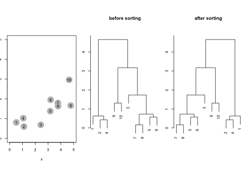
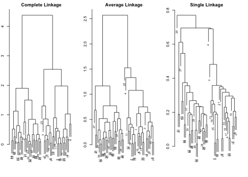
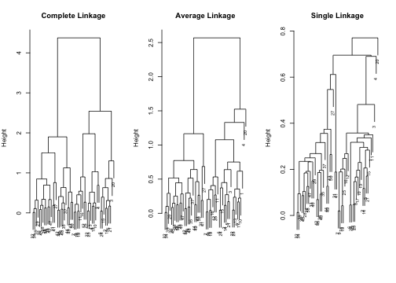
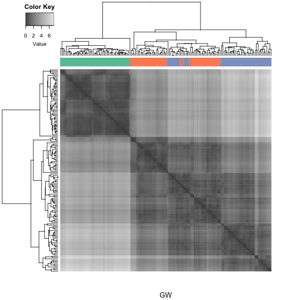
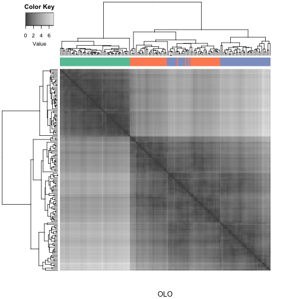
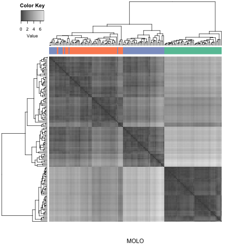
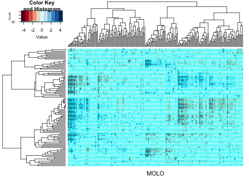
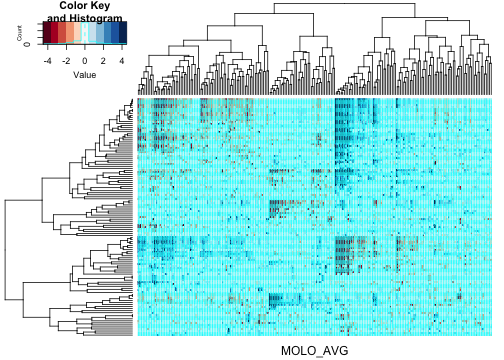
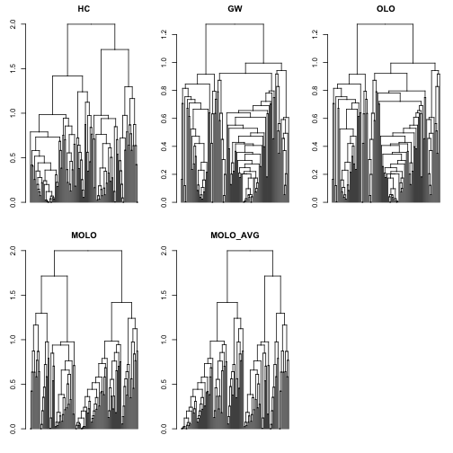

---
title: "Figures from Manuscript"
date: 25 September 2014
output: 
  rmarkdown::html_vignette:
    toc: true
vignette: >
  %\VignetteIndexEntry{"Figures from Manuscript"}
  %\VignetteEngine{knitr::rmarkdown}
  %\VignetteEncoding{UTF-8}
---

(**Note:** Modifications were made to this Rmarkdown document to replace the function `heatmap.plus::heatmap.plus()` with `gplots::heatmap.2()`, as the package `heatmap.plus` was removed from CRAN. Edited on April 17, 2021, Evan Biederstedt.)

This is an R Markdown document which shows how figures from the manuscript <http://f1000research.com/articles/3-177/v1> were generated. To generate these figures, you will need to install the following packages:`dendsort`,`seriation`, `gplots`, and `RColorBrewer`.  If you have not yet installed these packages, make sure to install them before moving on to the next step.


```r
install.packages("dendsort")
install.packages("seriation")
install.packages("gplots")
install.packages("RColorBrewer")
```

If you have installed these packages, you can now load these libraries.


```r
library("dendsort")
library("seriation")
library("gplots")
library("RColorBrewer")
```

Let's start with Figure 2. This figure contains 3 plots. A scatter plot of a simulated data sets, a dendrogram drawn using the default heuristics, and a dendrogram reordered using a function from `dendsort`.


```r
#simulate the data
set.seed(1234)
x <- rnorm(10, mean=rep(1:5, each=2), sd=0.4)
y <- rnorm(10, mean=rep(c(1,2), each=5), sd=0.4)
dataFrame <- data.frame(x=x, y=y, row.names=c(1:10))
#calculate distance matrix. default is Euclidean distance
distxy <- dist(dataFrame)
#perform hierarchical clustering. The default is complete linkage.
hc <- hclust(distxy)
#plot Figure 2
par(mfrow = c(1, 3), mai=c(1,0.2,1,0.2))
#Scatter plot
plot(x, y, col="gray", pch=19, cex=3.5, xlim=c(0,5), ylim=c(0,5))
text(x, y, labels=as.character(1:10), cex=1)
#Default dendrogram
plot(hc, main="before sorting", sub ="", xlab="" )
#Reordered dendrogram
plot(dendsort(hc), main="after sorting", sub="", xlab="")
```



Figure 4 compares dendrogram structures as results of different linkage algorithm. This example was adapted from an example from The Elements of Statistical Learning (Hestie, T. et al).


```r
#simulate the data
set.seed(1234)
x=matrix(rnorm(50*2), ncol=2)
x[1:25, 1] = x[1:25, 1]+3
x[1:25, 2] = x[1:25, 2]-4
x = scale(x)
#different linkage types
hc.complete = hclust(dist(x), method="complete")
hc.average = hclust(dist(x), method="average")
hc.single = hclust(dist(x), method="single")
#generate Figure 4
par(mfrow=c(1,3), mar = c(2, 2, 2, 2))
plot(hc.complete, main="Complete Linkage", xlab="", sub="", cex=0.7)
plot(hc.average, main="Average Linkage", xlab="", sub="", cex=0.7)
plot(hc.single, main="Single Linkage", xlab="", sub="", cex=0.7)
```


In contrast to the previous figure, Figure 5 shows reordered dendrogram structures. We find the reordered dendrograms easier to study the nested structure and to compare between one another, because the linear leaf order in these dendrograms reflect the order in which clusters are merged. Also, the reordered dendrograms reflect the underlying difference in linkage algorithms more closely.  For example, the average linkage is an intermediate approach between the single and complete linkage algorithm to define cluster proximity.


```r
par(mfrow=c(1,3), mar = c(5, 4, 4, 2))
plot(dendsort(hc.complete), main="Complete Linkage", xlab="", sub="", cex=0.7)
plot(dendsort(hc.average), main="Average Linkage", xlab="", sub="", cex=0.7)
plot(dendsort(hc.single), main="Single Linkage", xlab="", sub="", cex=0.7)
```



## Iris Data set
Figure 6 demonstrates comparison of leaf ordering methods.  This case study extends the demonstration of seriation-based leaf ordering methods by Buchta et al. using the Fisher's Iris data set. We compare with the implementation of the Gruvaeus and Wainer's method (GW) and the optimal leaf ordering (OLO).  These implementations are available in the `seriation` package.


```r
#load the iris data
data("iris")
x <- as.matrix(iris[-5]) #drop the 5th colum
d <- dist(x) #calculate Euclidian distance
#Comparing different seriation methods
methods <- c("HC", "GW", "OLO")
results <- sapply(methods, FUN=function(m) seriate(d, m), simplify = FALSE)
```

```
## Registered S3 method overwritten by 'gclus':
##   method         from     
##   reorder.hclust seriation
```

```r
#get hclust objects
hc_HC = results[["HC"]][[1]]
hc_GW = results[["GW"]][[1]]
hc_OLO = results[["OLO"]][[1]]
#to color by spieces
sideColors = rep( "#000000", nrow(iris))
sideColors[which(iris$Species == "setosa" )] = "#66C2A5";
sideColors[which(iris$Species == "versicolor" )] = "#FC8D62";
sideColors[which(iris$Species == "virginica")] = "#8DA0CB";

par(mar=c(2, 5, 5, 2))
# HC
heatmap.2(as.matrix(d), col=gray.colors(100), dendrogram ="both",
          Rowv=rev(as.dendrogram(hc_HC)), Colv=(as.dendrogram(hc_HC)),
          scale="none", labRow="", labCol="", ColSideColors = sideColors,
          symm = TRUE, key = TRUE, keysize =1, trace="none", density.info="none", xlab="HC")
```


```r
#legend("topright", pch = 15, col = c("#66C2A5", "#FC8D62", "#8DA0CB"), legend = c("setosa", "versicolor", "virginica"))

#GW
heatmap.2(as.matrix(d), col=gray.colors(100), dendrogram ="both",
          Rowv=rev(as.dendrogram(hc_GW)), Colv=(as.dendrogram(hc_GW)),
          scale="none", labRow="", labCol="", ColSideColors = sideColors,
          symm =TRUE, key = TRUE, keysize =1, trace="none", density.info="none", xlab="GW")
```



```r
#legend("topright", pch = 15, col = c("#66C2A5", "#FC8D62", "#8DA0CB"), legend = c("setosa", "versicolor", "virginica"))

#OLO
heatmap.2(as.matrix(d), col=gray.colors(100), dendrogram ="both",
          Rowv=rev(as.dendrogram(hc_OLO)), Colv=(as.dendrogram(hc_OLO)),
          scale="none", labRow="", labCol="", ColSideColors = sideColors,
          symm =TRUE, key = TRUE, keysize =1, trace="none", density.info="none", xlab="OLO")
```



```r
#legend("topright", pch = 15, col = c("#66C2A5", "#FC8D62", "#8DA0CB"), legend = c("setosa", "versicolor", "virginica"))

#MOLO
hc_MOLO = dendsort(hc_HC)
heatmap.2(as.matrix(d), col=gray.colors(100), dendrogram ="both",
          Rowv=rev(as.dendrogram(hc_MOLO)), Colv=(as.dendrogram(hc_MOLO)),
          scale="none", labRow="", labCol="", ColSideColors = sideColors,
          symm =TRUE, key = TRUE, keysize =1, trace="none", density.info="none", xlab="MOLO")
```



```r
#legend("topright", pch = 15, col = c("#66C2A5", "#FC8D62", "#8DA0CB"), legend = c("setosa", "versicolor", "virginica"))
```

## TCGA examples
Figure 1 is a cluster heatmap of the data matrix from the integrated pathway analysis of gastric cancer from the Cancer Genome Atlas (TCGA) study. We will use the sample dataset included in the `dendsort` package. We will use the `heatmap.2` method from `gplots` library to plot.


```r
par(mfrow=c(1,3), mar = c(5, 4, 4, 2))
data(sample_tcga)
#transpose
dataTable <- t(sample_tcga)
#calculate the correlation based distance
row_dist <- as.dist(1-cor(t(dataTable), method = "pearson"))
col_dist <- as.dist(1-cor(dataTable, method = "pearson"))
#hierarchical clustering
col_hc <- hclust(col_dist, method = "complete")
row_hc <- hclust(row_dist, method = "complete")
```

Figure 7 and 9 show cluster heatmaps as results of modular leaf ordering (MOLO) methods. Figure 7 uses the MOLO based on the smallest distance, while Figure 8 uses the method based on the average distance.


```r
par(mfrow=c(1,3), mar = c(5, 4, 4, 2))
#MOLO Figure 7
heatmap.2(dataTable, Rowv=dendsort(as.dendrogram(row_hc), isRevers=TRUE), Colv=dendsort(as.dendrogram(col_hc)),
             labRow="", labCol="", margins = c(2,1), xlab = "MOLO", 
             col=brewer.pal(11, "RdBu"))
```



```r
#MOLO_AVG Figure 9
heatmap.2(dataTable, Rowv=dendsort(as.dendrogram(row_hc), isRevers=TRUE, type="average"), Colv=dendsort(as.dendrogram(col_hc), type="average"),
             labRow="", labCol="", margins = c(2,1), xlab = "MOLO_AVG", 
             col=brewer.pal(11, "RdBu"))
```



The following scripts generate Figure 8 and 10 to compare dendrogram structures. 

```r
#seriation based method (GW and OLO)
methods <- c("GW", "OLO")
row_results <- sapply(methods, FUN=function(m) seriate(row_dist, m), simplify = FALSE)
row_gw <- row_results[["GW"]][[1]]
row_olo <- row_results[["OLO"]][[1]]
col_results <- sapply(methods, FUN=function(m) seriate(col_dist, m), simplify = FALSE)
col_gw <- col_results[["GW"]][[1]]
col_olo <- col_results[["OLO"]][[1]]

#dendrogram comparison # Figure 8
par(mar=c(2, 3, 2,1), mfrow = c(5, 1))
plot(as.dendrogram(row_hc), leaflab= "none", main ="HC")
plot(as.dendrogram(row_gw), leaflab= "none", main ="GW")
plot(as.dendrogram(row_olo), leaflab= "none", main ="OLO")
plot(dendsort(as.dendrogram(row_hc)), leaflab= "none", main ="MOLO")
plot(dendsort(as.dendrogram(row_hc), type="average"), leaflab= "none", main ="MOLO_AVG")

#dendrogram comparison # Figure 10
par(mar=c(2, 3, 2,1), mfrow = c(2, 3))
plot(as.dendrogram(row_hc), leaflab= "none", main ="HC")
plot(as.dendrogram(row_gw), leaflab= "none", main ="GW")
plot(as.dendrogram(row_olo), leaflab= "none", main ="OLO")
plot(dendsort(as.dendrogram(row_hc)), leaflab= "none", main ="MOLO")
plot(dendsort(as.dendrogram(row_hc), type="average"), leaflab= "none", main ="MOLO_AVG")
```



The values in Table 1 were calculated as following.

```r
#Table 1
#calculate the length
l_hc = cal_total_length(as.dendrogram(row_hc))
l_gw = cal_total_length(as.dendrogram(row_gw))
l_olo = cal_total_length(as.dendrogram(row_olo))
l_molo = cal_total_length(dendsort(as.dendrogram(row_hc)))
l_molo_avg = cal_total_length(dendsort(as.dendrogram(row_hc), type ="average"))
#ratio
l_gw/l_hc
```

```
## [1] 1.53381
```

```r
l_olo/l_hc
```

```
## [1] 1.484413
```

```r
l_molo/l_hc
```

```
## [1] 0.8804773
```

```r
l_molo_avg/l_hc
```

```
## [1] 0.7815117
```
